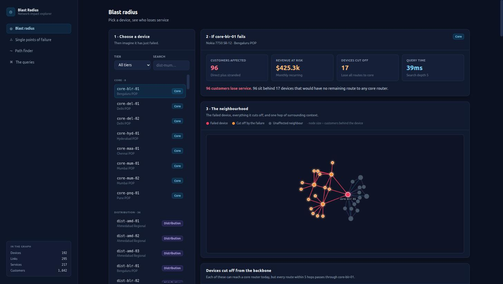
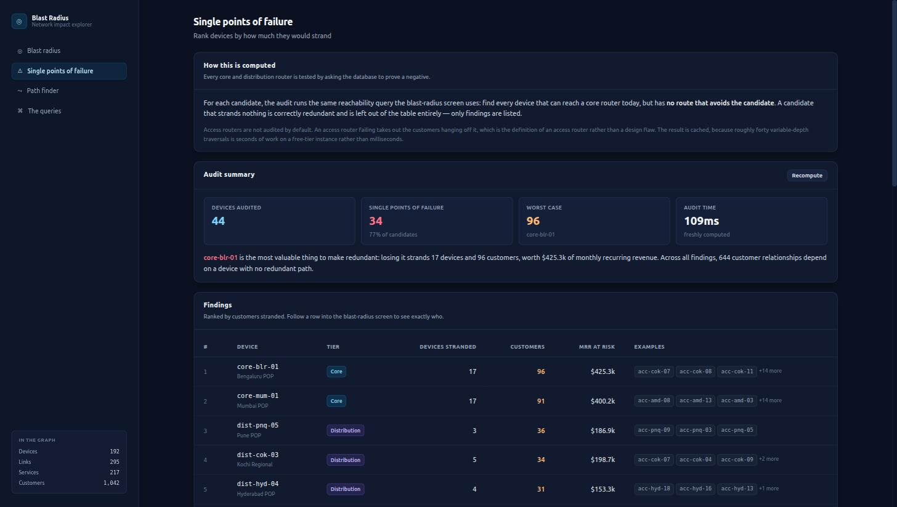
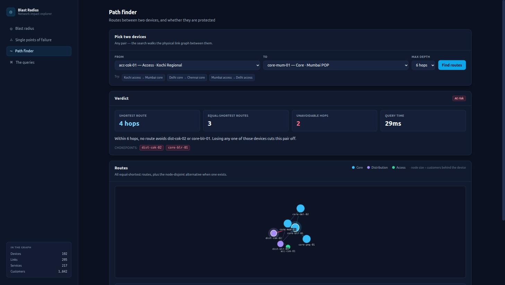
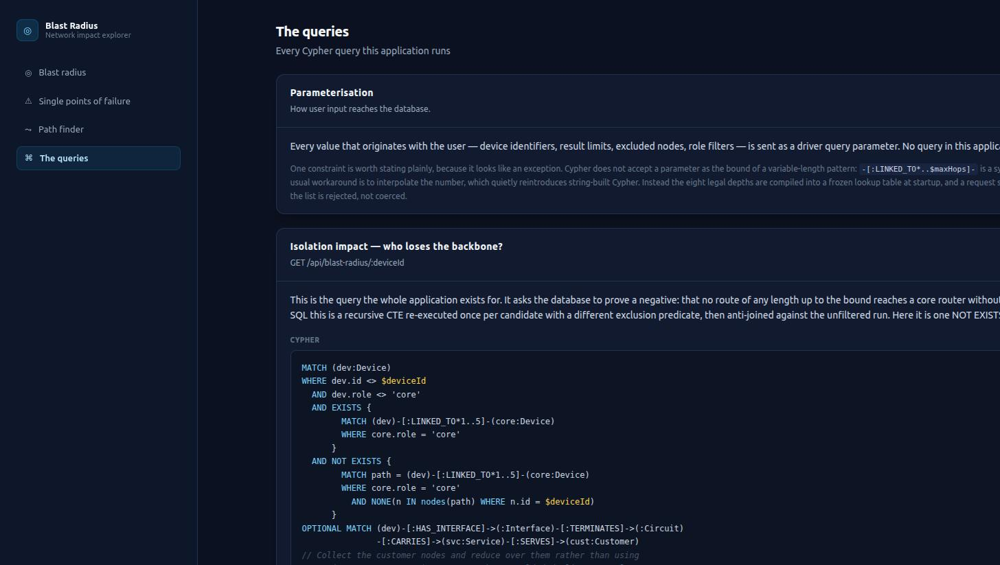

# Network Blast Radius Explorer

**A graph application on CognoDB Cloud that answers the question every network operator asks before a maintenance window: _if this router goes down, who loses service?_**

Built with React + Tailwind CSS and Node.js + Express, talking to CognoDB Cloud over Bolt with the official `neo4j-driver` and openCypher.

> **Hosted demo:** _<!-- TODO: paste your Render/Fly URL here after deploying -->_
> **Screen recording:** _<!-- TODO: paste your recording link here -->_



---

## Contents

- [The use case](#the-use-case)
- [Why a graph database?](#why-a-graph-database)
- [The data model](#the-data-model)
- [What the application does](#what-the-application-does)
- [The queries, explained](#the-queries-explained)
- [Running it](#running-it)
- [Deploying it](#deploying-it)
- [Project structure](#project-structure)
- [Design decisions and their trade-offs](#design-decisions-and-their-trade-offs)

---

## The use case

A service-provider network is a mesh of routers, physical links, circuits, services and
customers. Operators run into three questions constantly, and all three are about
**connections**, not rows:

1. **"We're taking `core-blr-01` down at 02:00 for a line-card swap. Who loses service?"**
   Not "what is attached to it" — that is the easy half. The hard half is every device
   elsewhere in the network whose *only* remaining route to the backbone happened to run
   through it.

2. **"This customer is complaining about reliability. Are they actually single-homed?"**
   A pair of devices can have four distinct routes between them that all cross the same
   aggregation router. Four paths is not redundancy.

3. **"Where should the redundancy budget go?"**
   Which single device, if it failed, would strand the most customers?

This application answers all three against a seeded 192-device network spanning eight
sites, and shows the Cypher it used to do it.

The dataset is synthetic but shaped like a real network: a meshed core, mostly dual-homed
distribution and access tiers, and — importantly — pockets of single-homed kit that nobody
got round to fixing. Two "spur" sites (Kochi and Ahmedabad) are regional aggregation points
with no local core router, reaching the backbone through a single designated gateway. That
is a pattern real networks accumulate, and it is what makes the audit produce a finding
worth acting on rather than a clean bill of health.

---

## Why a graph database?

The application's central query is **isolation impact**: after removing device `D`, which
devices no longer have *any* route to a core router?

In Cypher, that is the question written down:

```cypher
MATCH (dev:Device)
WHERE dev.id <> $deviceId
  AND dev.role <> 'core'
  AND EXISTS {
        MATCH (dev)-[:LINKED_TO*1..5]-(core:Device)
        WHERE core.role = 'core'
      }
  AND NOT EXISTS {
        MATCH path = (dev)-[:LINKED_TO*1..5]-(core:Device)
        WHERE core.role = 'core'
          AND NONE(n IN nodes(path) WHERE n.id = $deviceId)
      }
RETURN dev
```

Read it aloud: *find devices that can reach a core router today, but have no route to any
core router that avoids the failed device.*

**What the relational version costs.** There is no single SQL statement for this. You need
a recursive CTE to compute reachability, and because the exclusion predicate changes per
candidate device, you must re-run it once per candidate and anti-join the result against
the unfiltered run:

```sql
WITH RECURSIVE reachable_without(device_id, hops) AS (
  SELECT b_device_id, 1 FROM links WHERE a_device_id = :dev AND b_device_id <> :failed
  UNION            -- ... plus the symmetric direction, links being undirected
  SELECT l.b_device_id, r.hops + 1
    FROM reachable_without r
    JOIN links l ON l.a_device_id = r.device_id
   WHERE l.b_device_id <> :failed AND r.hops < 5
)
SELECT ...  -- then repeat the whole thing without the exclusion, and take the difference
```

It is writable. It is not readable, it is not reusable across the four other traversals in
this application, and the exclusion predicate has to be threaded through every level of the
recursion by hand. The graph version is one `NOT EXISTS` clause, and the query planner
handles the path search.

**Three more places the graph earns its keep here:**

| | Graph | Relational |
|---|---|---|
| **Heterogeneous traversal** — `Device → Interface → Circuit → Service → Customer` | one path pattern | four joins whose order the planner must be coaxed into |
| **Variable depth** — "within 5 hops, any route" | `*1..5` | a recursive CTE with a manual depth counter |
| **Schema evolution** — adding `PEERS_WITH` or `PROTECTED_BY` | additive; existing queries untouched | a new join table plus edits to every traversal query |

**Where the graph does *not* win, stated honestly.** The direct-impact query — the services
physically attached to one device — is a fixed four-hop traversal. A relational schema
handles that perfectly well with four joins, and it is included in the query catalogue
precisely so the comparison is not stacked. The graph wins on the *reachability* half, and
that half is where the operational value is.

---

## The data model

```
                        ┌──────────┐
                        │   Site   │
                        └────▲─────┘
                             │ LOCATED_IN
                        ┌────┴─────┐
           LINKED_TO    │  Device  │    LINKED_TO
        ┌──────────────▶│          │◀──────────────┐
        │               └────┬─────┘               │
        │                    │ HAS_INTERFACE       │
        │               ┌────▼──────┐              │
        └───────────────│ Interface │──────────────┘
                        └────┬──────┘
                             │ TERMINATES
                        ┌────▼─────┐
                        │ Circuit  │
                        └────┬─────┘
                             │ CARRIES
                        ┌────▼─────┐
                        │ Service  │
                        └────┬─────┘
                             │ SERVES
                        ┌────▼─────┐
                        │ Customer │
                        └──────────┘
```

### Nodes

| Label | Properties | Count |
|---|---|---|
| `Site` | `id`, `name`, `city`, `region`, `code` | 8 |
| `Device` | `id`, `name`, `role` (`core`/`distribution`/`access`), `vendor`, `model`, `mgmtIp`, `status` | 192 |
| `Interface` | `id`, `name`, `speedGbps`, `status` | 807 |
| `Circuit` | `id`, `name`, `type` (`backbone`/`access`), `capacityGbps`, `status` | 512 |
| `Service` | `id`, `name`, `type` (`internet`/`mpls-vpn`/`voice`/`video`), `slaTier`, `status` | 217 |
| `Customer` | `id`, `name`, `segment` (`enterprise`/`smb`/`residential`), `mrr` | 1,042 |

**2,778 nodes and 3,360 relationships** — comfortably inside the free tier's 256 MB.

### Relationships

| Pattern | Meaning | Count |
|---|---|---|
| `(Device)-[:LOCATED_IN]->(Site)` | physical location | 192 |
| `(Device)-[:HAS_INTERFACE]->(Interface)` | ports on a device | 807 |
| `(Interface)-[:TERMINATES]->(Circuit)` | a circuit lands on a port | 807 |
| `(Circuit)-[:CARRIES]->(Service)` | a service rides a circuit | 217 |
| `(Service)-[:SERVES]->(Customer)` | who is buying it | 1,042 |
| `(Device)-[:LINKED_TO {circuitId, capacityGbps, kind}]->(Device)` | device adjacency | 295 |

### The one denormalisation, and why

`LINKED_TO` is **derived at seed time** from the
`Device → Interface → Circuit → Interface → Device` chain. Two representations of the same
fact is a smell, so it is worth justifying:

- Device-to-device traversal is the hot path for every screen in the application.
- Walking it through interfaces costs three relationship hops per logical device hop, so a
  five-device-hop search becomes a fifteen-hop pattern.
- The free tier is 0.5 vCPU. A fifteen-hop variable-length expansion over a meshed backbone
  is not something that finishes politely.

Interfaces and circuits stay in the graph as provenance — the UI shows *which* circuit a
link is, and `LINKED_TO.circuitId` points back to it. The risk of the two representations
drifting is contained by deriving both from the same link list in a single pass in
`server/scripts/seed.js`, so they cannot be updated independently.

---

## What the application does

### 1 · Blast radius explorer

Pick any device, treat it as failed, and see the consequences split into the two things
that are genuinely different:

- **Direct impact** — services whose circuits terminate on this device.
- **Isolation impact** — devices elsewhere that lose every route to the backbone.

A core router has no directly attached customers at all, so its entire blast radius comes
from the second query. An access router's comes almost entirely from the first. Neither
query alone answers "who loses service".

Selecting `core-blr-01` strands **17 devices and 96 customers**, worth **$425k** of monthly
recurring revenue — the entire Kochi region, which reaches the backbone through that one
router.

### 2 · Single point of failure audit



Runs the isolation query against every core and distribution router and ranks the results.
34 of 44 audited devices turn out to be single points of failure. The audit reuses the exact
query the blast-radius screen runs, so the two screens cannot report different numbers.
Clicking a row opens the full breakdown for that device.

### 3 · Path finder



Finds every equal-shortest route between two devices, then tests redundancy properly.

The verdict distinguishes three states, and the distinction is the point:

- **Protected** — a route exists that shares no intermediate hop with the primary path.
- **Survives any single failure** — no fully node-disjoint route exists, but no individual
  hop is unavoidable either; each can be routed around separately.
- **At risk** — at least one specific device cannot be routed around at all.

That middle state matters. "No disjoint path exists" does **not** imply "any of these hops
is fatal" — every route could cross *some* hop from the set while no single hop is
unavoidable. Reporting the first as the second would be a false alarm an operator would act
on, so each hop is tested individually.

### 4 · The queries



Every Cypher statement the application runs, with the parameters it is called with and a
note on what makes it a graph query. The text is imported from the same modules the API
executes, so what is displayed and what is sent to the database cannot drift apart.

It is deliberately **not** a free-text console. A Cypher box against a live demo instance is
a write-and-delete surface, and it would demonstrate nothing that these queries do not.

---

## The queries, explained

### Isolation impact — the headline

Covered in [Why a graph database?](#why-a-graph-database) above. Two clauses do the work:
`EXISTS { ... }` excludes devices that were already unreachable, so a pre-existing outage is
never blamed on this failure; `NOT EXISTS { ... NONE(n IN nodes(path) ...) }` asks the
database to prove no route avoids the failed device.

**On the depth bound.** `*1..5` is not a guess. Across every single-device failure in the
seeded topology, the longest surviving route from any device to a core router is five hops
(`dist-mum-02` after `core-mum-01` fails, reaching the backbone the long way round through a
peer site). The bound errs in one direction only: too small and a device whose only
surviving route is longer gets reported as isolated when it is not — a false alarm, never a
missed one. A bound of 4 produced exactly one such false positive; 5 matches an unbounded
breadth-first search on all 192 devices. A larger or differently-shaped network would need
this re-derived.

### Direct impact

```cypher
MATCH (d:Device { id: $deviceId })-[:LOCATED_IN]->(site:Site)
OPTIONAL MATCH (d)-[:HAS_INTERFACE]->(i:Interface)-[:TERMINATES]->(ckt:Circuit)
               -[:CARRIES]->(svc:Service)-[:SERVES]->(cust:Customer)
RETURN d.id AS deviceId, ..., cust.mrr AS mrr
```

Four hops across five labels. `OPTIONAL MATCH` matters: a core router has no attached
services, and the query must still return the device row rather than nothing at all.

### Path finder

```cypher
MATCH (a:Device { id: $fromId })
MATCH (b:Device { id: $toId })
MATCH path = allShortestPaths((a)-[:LINKED_TO*..6]-(b))
RETURN [n IN nodes(path) | { id: n.id, name: n.name, role: n.role }] AS hops, length(path) AS hopCount
LIMIT toInteger($limit)
```

`allShortestPaths` runs a bidirectional breadth-first search and returns every joint-shortest
result in one pass. The redundancy check re-runs a `shortestPath` with `$excludeIds` set to
the hops being tested.

### Parameterisation — and the one apparent exception

Every value originating with the user — device ids, limits, excluded nodes, role filters —
is passed as a driver query parameter. No query is assembled by string concatenation.

Two details are worth stating because they look like exceptions and are not:

1. **Variable-length bounds cannot be parameters.** `-[:LINKED_TO*..$maxHops]-` is a *syntax
   error* in Cypher, not a runtime failure. The usual workaround is to interpolate the
   number, which quietly reintroduces string-built Cypher. Instead, the eight legal depths
   are compiled into a frozen lookup table at module load
   (`server/src/queries/pathFinder.js`); a request selects an entry by integer and a depth
   outside the list is **rejected**, not coerced. User input never contributes text to a
   query.

2. **`LIMIT toInteger($limit)`**, not `LIMIT $limit`. The driver is configured with
   `disableLosslessIntegers`, which means an outgoing JavaScript number serialises as a
   float, and Cypher rejects `LIMIT 300.0`. Coercing inside the query keeps the query
   modules free of driver-specific types. (This one was found by the API returning a 500 on
   the very first live request — the seed script had the same problem for integer
   properties, fixed with `toInteger()` in the `SET` clauses.)

---

## Running it

### Prerequisites

- Node.js 20 or newer
- A CognoDB Cloud instance (free tier, no credit card)

### 1 · Create a CognoDB Cloud instance

1. Sign up at **<https://console.cognodb.com/signup>**.
2. Create a free **c0** instance and pick a region. It provisions in under a minute.
3. Copy the connection URI (`bolt+s://<instance-id>.databases.cognodb.cloud`) and the
   generated password for the user `cognodb`.
   **The password is shown exactly once** — save it immediately.

### 2 · Configure

```bash
cp .env.example .env
```

Fill in:

```dotenv
COGNODB_URI=bolt+s://<instance-id>.databases.cognodb.cloud
COGNODB_USER=cognodb
COGNODB_PASSWORD=<the password shown once>
```

`.env` is gitignored. No URI or password appears anywhere in this repository.

### 3 · Install and seed

```bash
npm run install:all     # installs server and client dependencies
npm run seed            # applies schema, generates the topology, writes it
```

The seed is idempotent — it `MERGE`s on business keys, so running it twice is safe. Use
`npm run seed:reset` to wipe and rebuild from scratch.

Expected output ends with:

```
Graph contents:
  nodes:
    Circuit      512
    Customer     1042
    Device       192
    Interface    807
    Service      217
    Site         8
  relationships:
    CARRIES          217
    HAS_INTERFACE    807
    LINKED_TO        295
    LOCATED_IN       192
    SERVES           1042
    TERMINATES       807
```

### 4 · Run

**Development** — two processes, with hot reload and the API proxied through Vite:

```bash
npm run dev:server      # http://localhost:8080
npm run dev:client      # http://localhost:5173  ← open this one
```

**Production-style** — one process serving both:

```bash
npm run build           # builds the React bundle
npm start               # http://localhost:8080
```

### 5 · Docker

```bash
docker build -t blast-radius .
docker run -p 8080:8080 --env-file .env blast-radius
```

---

## Deploying it

The image is a single service: Express serves the API and the built React bundle from one
process on one port. That is one thing to deploy, one origin, and no CORS in production.

**Render** — a `render.yaml` blueprint is included:

1. Push this repository to GitHub.
2. Render → **New → Blueprint** → point it at the repository.
3. Set `COGNODB_URI`, `COGNODB_USER` and `COGNODB_PASSWORD` when prompted. They are marked
   `sync: false`, so Render asks for them and stores them encrypted rather than reading them
   from the file.
4. Deploy. Seed once from any machine with the same `.env` (`npm run seed`) — the database
   is external to the web service, so seeding does not need to happen inside it.

Anywhere that runs a Docker image works the same way — Fly, Railway, Cloud Run — provided
the three environment variables are set.

---

## Project structure

```
├── client/                       React + Tailwind frontend (Vite)
│   └── src/
│       ├── api/                  fetch wrapper + error normalisation
│       ├── components/           GraphCanvas, UI primitives, badges
│       ├── features/             one folder per screen
│       ├── hooks/                useApi
│       └── lib/                  colour and formatting helpers
├── server/
│   ├── scripts/                  generate.js · schema.js · seed.js
│   └── src/
│       ├── config/               environment loading and validation
│       ├── db/                   driver lifecycle, read/write sessions
│       ├── queries/              Cypher + parameter builders + row mappers
│       ├── services/             orchestration, caching, composition
│       ├── routes/               thin HTTP layer
│       ├── middleware/           error translation, async wrapper, logging
│       └── lib/                  TTL cache, concurrency pool
├── docs/
│   ├── specs/                    design document written before the code
│   └── screenshots/
├── Dockerfile                    multi-stage, single-service
└── render.yaml                   one-click deploy blueprint
```

Two companion documents explain the code module by module:

- **[IMPLEMENTATION_BACKEND.md](IMPLEMENTATION_BACKEND.md)**
- **[IMPLEMENTATION_FRONTEND.md](IMPLEMENTATION_FRONTEND.md)**

---

## Design decisions and their trade-offs

**The API never writes.** Every session is opened with `defaultAccessMode: READ`. Only the
seed and schema scripts use write sessions. The read-only contract is visible in the code
rather than only in the documentation.

**The server starts even when the database does not.** If the instance is asleep, the
credentials are wrong, or `.env` was never created, the API still comes up and returns 503
with a code the UI turns into an explanation. A process that exits on boot gives the user a
blank page and a container restart loop. Both failure modes were verified by running the
container against a black-holed address and against a wrong password:

| Condition | Response |
|---|---|
| Host unreachable | `503 database_unavailable` + hint to check the instance and URI |
| Wrong credentials | `503 database_unauthorized` + hint to check `.env` |
| `.env` missing | `503 configuration_error` + hint to copy `.env.example` |
| Broken Cypher (our bug) | `500 internal_error` — deliberately *not* reported as a database outage |

**The SPOF audit is cached, and that is a real trade-off.** It issues ~44 variable-depth
traversals. Computing it in application code from an in-memory copy of the graph would be
faster, but the point of the exercise is that the database can answer this, and an in-memory
copy is one more thing that can silently disagree with the data. Instead: candidates are
limited to core and distribution routers, queries run through a four-way concurrency pool,
and the ranked result is cached with a 5-minute TTL (2.6 ms warm). In-flight computations
are shared, so a page refresh mid-audit does not start a second one.

**The Cypher screen is preset-driven.** Covered above — a free-text console is a write
surface with no upside for this assignment.

### Verification

The isolation query was checked against an independent unbounded breadth-first search
implemented separately in JavaScript, for **all 192 devices** — zero mismatches. That test is
what surfaced the depth-bound false positive described earlier. The SPOF audit's 34 findings
and the top-line figures for `core-blr-01` (17 devices / 96 customers) match the independent
implementation exactly.

### Known limits

- **Transit realism.** The reachability model is pure connectivity: it will route through an
  access router if the graph allows it, whereas a real network's routing policy would not.
  Encoding policy would mean a `transit: true` property and an extra predicate on each path.
  Left out deliberately — it would make the queries harder to read for a gain that does not
  change any finding in this dataset.
- **Single-process cache.** The TTL cache is in-memory. A multi-instance deployment would
  want Redis.
- **Path-finder verdicts are bounded.** "At risk" means *within the selected hop limit*. The
  UI states the bound rather than implying an absolute claim.
